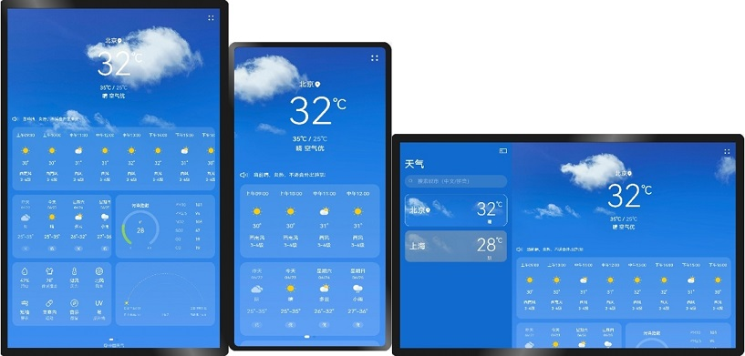

# Weather

### Introduction

This sample demonstrates one-time development for multi-device deployment by showing how to develop a weather app and deploy it across different devices. The demo app includes the following: home page, **Manage City** page, **Add City** page, and **Update Time** page.

**How to Implement**

1. Use the grid breakpoint system of responsive layout to implement different display effects on windows of different sizes.

2. Use [SideBarContainer](https://gitee.com/openharmony/docs/blob/master/en/application-dev/reference/arkui-ts/ts-container-sidebarcontainer.md) to implement the sidebar.

3. Use [GridRow](https://gitee.com/openharmony/docs/blob/master/en/application-dev/reference/arkui-ts/ts-container-gridrow.md) to implement content split and display.

4. Use **Canvas** and **CanvasRenderingContext2D** to draw curves that show the air quality and sunrise and sunset.

**How to Use**

1. After the demo app is started, weather information of the added cities is displayed on the home page. By default, two cities are present. You can swipe left or right to switch between them. The sidebar is displayed by default on a large-screen (LG) device. When the sidebar is displayed, the content area occupies 2/3 of the screen; when the sidebar is hidden, the content area automatically extends to full screen.

2. On a device that supports free window dragging, you can drag the window to the maximum width to show the sidebar. In this case, you can tap the sidebar control button to hide or display the sidebar. If you resize the window to MD through dragging, the sidebar and sidebar control buttons will be hidden.

3. On a device that supports window dragging, the weather content area is automatically adapted to the window size while you're dragging the window.

4. Touch the menu button in the upper right corner and tap **Update Time**. The **Update Time** page is displayed. This page has two columns on a tablet and one column on a small-screen device.

5. Touch the menu button in the upper right corner and tap **Manage Cities**. The **Manage Cities** page is displayed, showing the cities you've added. This page has two columns on a tablet and one column on a small-screen device like phone.

6. Touch **Add City** on the **Manage Cities** page. On the **Add City** page displayed, tap any city that has not been added before. The city will be added to the city list and the **Manage Cities** page will be displayed.

Display Effect

### Required Permissions

N/A

### Dependency

N/A

###  Constraints

1. This sample can only be run on standard-system devices.

2. This sample demonstrates the stage model, which supports only the SDK of API version 9 (SDK version: 3.2.11.9 Beta2).

3. DevEco Studio 3.1 Canary1 (Build Version: 3.1.0.400)must be used.
