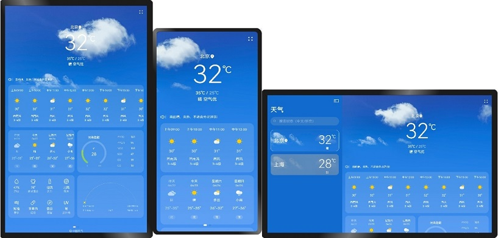

# 一多天气

### 介绍

本示例展示一个天气应用界面，包括首页、城市管理、添加城市、更新时间弹窗，体现一次开发，多端部署的能力。

1.本示例参考[一次开发，多端部署](https://gitee.com/openharmony/docs/tree/master/zh-cn/application-dev/key-features/multi-device-app-dev)的指导，主要使用响应式布局的栅格断点系统实现在不同尺寸窗口界面上不同的显示效果。

2.使用[SideBarContainer](https://gitee.com/openharmony/docs/blob/master/zh-cn/application-dev/reference/arkui-ts/ts-container-sidebarcontainer.md)实现侧边栏功能。

3.使用[栅格容器组件](https://gitee.com/openharmony/docs/blob/master/zh-cn/application-dev/reference/arkui-ts/ts-container-gridrow.md)实现界面内容的分割和展示。

4.使用Canvas和CanvasRenderingContext2D完成空气质量和日出月落图的曲线绘制。


### 效果预览

| 首页                              |
|--------------------------------------|
||

使用说明：

1.启动应用后，首页展示已添加城市的天气信息，默认展示2个城市，左右滑动可以切换城市，在LG设备上，默认显示侧边栏，侧边栏显示时，右侧内容区占2/3，侧边栏隐藏时，内容区自动铺满界面。

2.在支持窗口自由拖拽的设备上，拖拽窗口大小，可以分别实现拖动到最大窗口侧边栏显示（点击侧边栏控制按钮可以隐藏和显示侧边栏），拖动窗口缩小到MD大小时侧边栏和侧边栏控制按钮隐藏。

3.在支持窗口自由拖拽的设备上，拖拽窗口大小，天气内容区跟随窗口大小会自动换行显示。

4.点击右上角菜单按钮，在菜单中点击**更新时间**，弹出更新时间弹窗，没有功能，此处只做展示，在平板设备上显示2列，在小屏设备上显示一列。

5.点击右上角菜单按钮，在菜单中点击**管理城市**，进入管理城市界面，展示已添加的城市，在平板设备上显示2列，在小屏设备上显示一列。

6.点击管理城市界面的**添加城市**，进入添加城市界面，已添加的城市不可点击，未添加的城市点击可以添加并返回管理城市界面显示。

### 工程目录
```
/code/SuperFeature/MultiDeviceAppDev/Weather/product/default
└─src
    ├─main
    │  │
    │  ├─ets
    │  │  ├─Application
    │  │  │      MyAbilityStage.ts          //自定义ability
    │  │  │
    │  │  ├─common                          //公共资源库
    │  │  ├─feature
    │  │  │      AirQualityFeature.ts       //空气绘画
    │  │  │      SunCanvasFeature.ts        //晴天绘画
    │  │  │
    │  │  ├─MainAbility
    │  │  │      MainAbility.ts             //主窗口
    │  │  │
    │  │  └─pages
    │  │      │  AddCity.ets                //添加城市
    │  │      │  CityList.ets               //城市列表
    │  │      │  Home.ets                   //入口
    │  │      │
    │  │      └─home
    │  │              AirQuality.ets         //空气质量
    │  │              HomeContent.ets        //主页面
    │  │              HoursWeather.ets       //每小时天气组件
    │  │              IndexEnd.ets           //首页尾 
    │  │              IndexHeader.ets        //首页头
    │  │              IndexTitleBar.ets      //首页标题
    │  │              LifeIndex.ets          //生活建议
    │  │              MultidayWeather.ets    //天气组件
    │  │              SideContent.ets        //侧边栏
    │  │              SunCanvas.ets          //晴天样式
    │  │              UpdateTimeDialog.ets   //时间更新弹窗
    │  │
    │  └─resources                           //资源包                                             
```

### 具体实现
1、home.ets中引入SideContent()和homeContent()。  
2、定义showSideBar来判断是否展示侧边栏，定义mediaquery.MediaQueryListener媒体监听器smListener、mdListener、lgListener。  
3、在aboutToAppear调用mediaquery对界面进行监听,[源码参考](product/default/src/main/ets/pages/Home.ets )。     
4、监听到当前屏幕大小，调用this.isBreakpoint断点，对curBp、showSideBar进行赋值,[源码参考](product/default/src/main/ets/pages/Home.ets )。  

### 相关权限

不涉及。

### 依赖

不涉及。

###  约束与限制

1.本示例仅支持标准系统上运行。

2.本示例已适配API version 9版本SDK，版本号：3.2.11.9。

3.本示例需要使用DevEco Studio 3.1 Beta2 (Build Version: 3.1.0.400, built on April 7, 2023)及以上版本才可编译运行。

### 下载

如需单独下载本工程，执行如下命令：
```
git init
git config core.sparsecheckout true
echo code/SuperFeature/MultiDeviceAppDev/Weather/ > .git/info/sparse-checkout
git remote add origin https://gitee.com/openharmony/applications_app_samples.git
git pull origin master
```